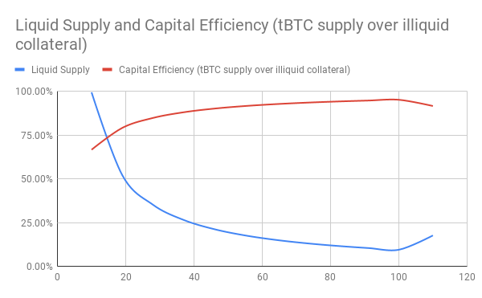

:toc: macro

[#bonding]
= Future Work

ifndef::tbtc[toc::[]]

In this section we describe improvements which can be made in the TBTC protocol
in order to its capital efficiency and security.

== Using TBTC instead of ETH for Signers' bonds

As described previously in the document, we require each 1 BTC deposit to be
backed by 1.5 BTC worth of ETH before 1 TBTC is minted on
Ethereum. The overcollateralization is done in order to prevent the system from
being undercollateralized when large ETH price fluctuations occur. This means
that  for each minted `1 TBTC` a total lockup of `2.5 BTC` value is required
(2.5x of the value).

Since the system's goal is to ensure that TBTC supply never exceeds the amount
of locked BTC, we can reduce this capital cost by allowing `1 TBTC` to back the
creation of another `1 TBTC`, regardless of the price between `TBTC` and `BTC`.
In case of signer misbehavior, the `1 TBTC` will be seized and burned,
maintaining the supply peg. Initially, the TBTC supply will be bootstrapped by
using ETH as bonds, and the system will get more capital efficient as TBTC is
used to back further TBTC minting.

[example]
=====
Consider 10 BTC under custody, 10 TBTC supply, and 9.95 TBTC in circulation (due to fees),
backed by 15 BTC worth of ETH.

By using 9 TBTC as collateral, 9 more TBTC can be minted,
resulting in a total supply of 19 TBTC, backed by 9 TBTC and 15 BTC worth of ETH on
Ethereum.

This results in 9.95 TBTC being liquid, while 10.05 is used in bonds.
If 9 TBTC more get created in the same way, only 9.9 TBTC would be liquid,
but the TBTC supply will be 28.

Following this example, the
capital efficiency (TBTC supply over illiquid collateral) of the mechanism can
approach 100% asymptotically, which is a significant improvement over the 66%
capital efficiency when using only ETH.

This mechanism effectively improves capital efficiency by
reducing TBTC liquidity. This incentive loop
can be maintained with proper fee generation to signers. We expect that signers
who want exposure in ETH will still use ETH as collateral, which will also
increase TBTC's liquidity. The following chart indicates how TBTC liquid supply
and capital efficiency behave in the previous example as the TBTC supply
approaches 100. Note how when we additionally back a deposit with ETH, TBTC
liquidity improves at the expense of capital efficiency.

// full data: https://docs.google.com/spreadsheets/d/1rG9XS6xJbulltwKBMfszfkHeqG5Bl6JboIpIjO1Qn3Q/edit#gid=0

=====

Note that each deposit yields fees based on the lot size, and **not based on
the collateral's size**. Due to overcollateralization, from a fees
perspective, an ETH backed deposit yields less fees per locked up BTC value
in ETH, compared to a TBTC backed deposit.

[example]
====
1 TBTC is minted by backing a Deposit with 75 ETH (1.5 BTC value in ETH). Per
annum, 0.005 TBTC is paid as fees to the signers, resulting in only `0.005/1.5 = 0.003
TBTC` revenue per locked BTC value in ETH. If TBTC were used as the backing asset, the
deposit would be backed with 1 TBTC, hence generating `0.005/1 = 0.005 TBTC` per
locked BTC value in TBTC, which is superior to the ETH case.

In the next section, we explore potential approaches towards
maximizing the fee revenue of signers by leveraging decentralized finance
lending  and market making protocols.
====

== Optimize returns on Signers' bonds

As explained in previous sections, the supply peg of TBTC to BTC is safely
maintained through mechanisms which rely on Signers overcollateralizing
deposits. Signers are rewarded with a
link:../signer-fees/index.adoc[fees] denominated in TBTC. In order to make
the system attractive to Signers and incentivize them to lock their ETH or TBTC
these fees should be sufficiently high without incurring a large cost to the
users of the system who want to minimize fees.

As illustrated recently by the
link:https://www.reddit.com/r/MakerDAO/comments/b5zgdl/no_loss_lottery_with_dai/[No-Loss
Lottery], leveraging the "decentralized finance" software stack can convert
zero-sum games, to positive-sum.

Following that approach, signing bonds can be used in lending or market making
platforms like link:compound.finance[Compound Finance] or
link:uniswap.io[Uniswap]. This would mean all signers would make returns atop an
approximation of the risk-free fees generated by the bond on the used platform,
improving their overall returns per unit used to back a Deposit.

These advantages come at the expense of added complexity around fund seizure (in
case the bond is not liquid due to being under control of the chosen platform).
Such reliance on third-party applications may bear significant risks,
as a result this tBTC functionality should be upgradeable (based on a
link:https://github.com/keep-network/tbtc/issues/119[tBTC-specific governance token]),
and should be easy to disable to account for potential security issues in the
external contracts.

Finally, each signer should be able to choose the platform where their bonds
will be used to increase their returns, depending on their risk profile. Signers
that do not want to bear third party risk should be able to opt-out of their
bond being lent out.
